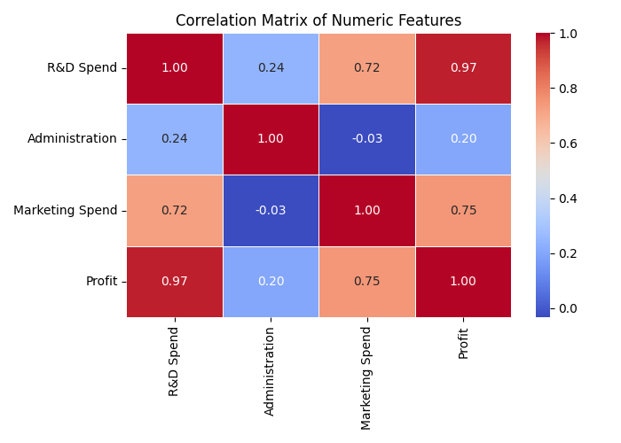
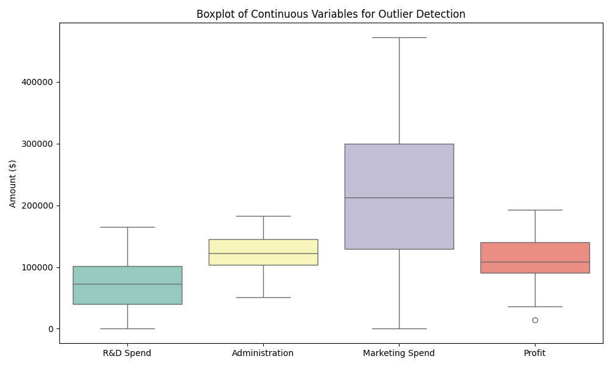
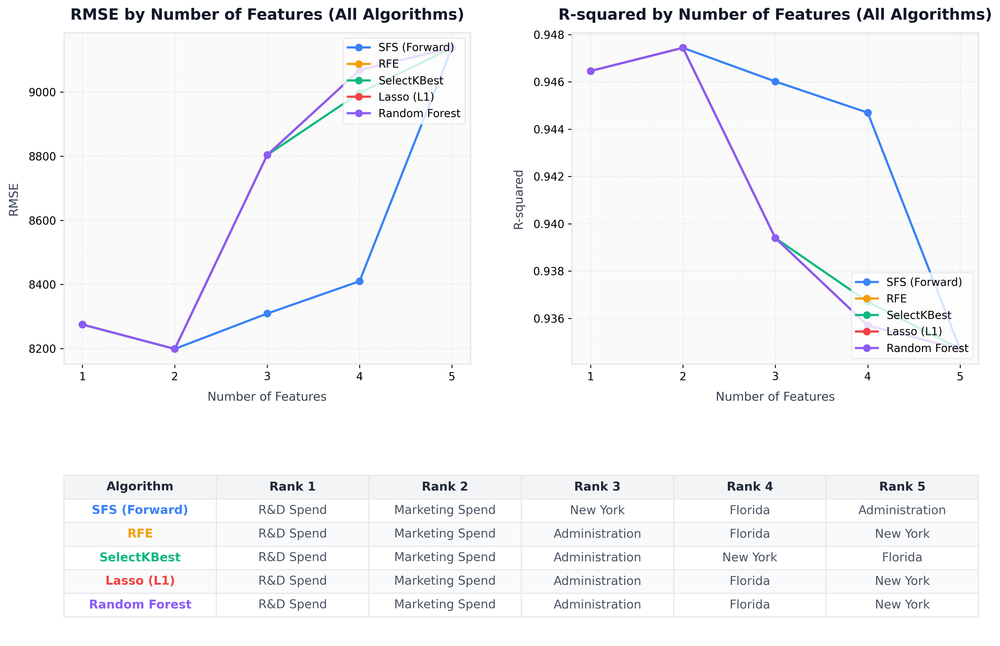

# L9 Kaggle 50 HW6 - CRISP-DM 專案分析報告

本報告完整記錄了基於 **CRISP-DM (Cross-Industry Standard Process for Data Mining)** 流程，針對 **Kaggle 50 Startups** 資料集進行新創公司利潤預測與特徵篩選的機器學習專案開發歷程與技術手冊。

---

## 📌 專案目錄與 CRISP-DM 流程架構
1. **[題目與商業目標 (Business Understanding)](#1-題目與商業目標-business-understanding)**
2. **[資料理解與特徵評估 (Data Understanding)](#2-資料理解與特徵評估-data-understanding)**
   - **[類別型特徵與獨熱編碼 (One-Hot Encoding)](#類別型特徵與獨熱編碼分析-one-hot-encoding)**
3. **[資料準備與特徵工程 (Data Preprocessing)](#3-資料準備與特徵工程-data-preprocessing)**
4. **[特徵篩選與效能分析 (Feature Selection Analysis)](#4-特徵篩選與效能分析-feature-selection-analysis)**
5. **[模型建立與成效對比 (Modeling & Evaluation)](#5-模型建立與成效對比-modeling--evaluation)**
6. **[模型部署與推論驗證 (Deployment)](#6-模型部署與推論驗證-deployment)**

---

## 1. 題目與商業目標 (Business Understanding)

新創公司（Startups）的成功與否與其資金分配有著極高關聯。創投機構（VC）或企業決策者在進行投資評估時，需要了解各項支出（研發、行政、行銷）如何影響公司的最終利潤，藉此優化投資組合與資源配置。

### 核心商業問題
> **如何根據新創公司的不同支出項目及所在地區，精準預測該公司的最終利潤（Profit）？**

### 關鍵商業問題 (Key Business Questions)
1. **更高的 R&D Spend（研發支出）是否必定帶來更高的利潤？**
2. **Marketing Spend（行銷支出）與利潤之間是否存在強烈正相關？**
3. **Administration Spend（行政管理支出）是否會顯著影響利潤的產生？**
4. **新創公司所在的州別（State）會如何影響其盈利能力？**
5. **我們能否建立一個高精準度的迴歸模型，用以輔助創投進行利潤預測？**

### 專案目標 (Project Goal)
本專案旨在開發一個基於 `scikit-learn` 的監督式機器學習迴歸模型，輸入新創公司的研發、行政、行銷支出及所在州別，輸出其預測利潤（Profit），並深入分析各特徵對利潤的影響力。

---

## 2. 資料理解與特徵評估 (Data Understanding)

本階段重點在於探索資料集結構、欄位分布、多重共線性診斷（VIF）及進行專家特徵評估。

### 欄位定義與專家分級

在進行機器學習建模前，結合商業邏輯與統計分析，對以下 4 個輸入特徵進行專家級定位：

| 特徵名稱 | 專家定位 | 預期重要性 | 建議處置 |
| :--- | :--- | :--- | :--- |
| **R&D Spend** | 核心成長因子 | 很高 (Very High) | 一定要納入模型 (利潤的關鍵驅動因子) |
| **Marketing Spend** | 市場擴張因子 | 中高 (Medium-High) | 保留並進行評估 (推動盈利的重要支柱) |
| **Administration** | 營運成本 / 規模因子 | 低到中 (Low-Medium) | 保留，但注意其與利潤相關性低且需防範共線性 |
| **State** | 地區輔助因子 | 低到中 (Low-Medium) | 進行 One-hot 編碼，做為模型微調的輔助特徵 |

> [!WARNING]
> **關於 State（地區輔助因子）的推論限制：**
> 雖然在描述性統計中可能會發現 Florida 平均利潤較高，但絕不能直接推論出「在 Florida 創業比在 California 更容易成功」。State 變數可能捕捉到的是地區稅率或基礎建設差異，但在本資料集（僅 50 筆）中其僅能作為輔助變數，不應過度解讀因果關係。

### 特徵相關性與共線性診斷

#### 1. 共線性診斷 (VIF 計算)
為防範多重共線性（Multicollinearity）影響線性模型係數解釋力，我們計算了連續型特徵的 **變異數膨脹因子 (Variance Inflation Factor, VIF)**：

*   **R&D Spend**: 2.47
*   **Marketing Spend**: 2.33
*   **Administration**: 1.18

VIF 值均小於關鍵門檻值 5（甚至 10），顯示各支出特徵間不存在嚴重多重共線性，可安心投入線性模型。

#### 2. 特徵相關性矩陣
數值型特徵與目標變數的 Pearson 相關係數如下：
*   **R&D Spend 與 Profit**: $r = 0.97$ (極高正相關)
*   **Marketing Spend 與 Profit**: $r = 0.75$ (顯著正相關)
*   **Administration 與 Profit**: $r = 0.20$ (弱正相關)



#### 3. 離群值檢測箱形圖
箱形圖顯示，大部分欄位的分布非常健康，僅有目標變數 `Profit` 存在一個低於下邊界的極端值（Outlier）。



### 類別型特徵與獨熱編碼分析 (One-Hot Encoding)

在進行機器學習建模時，我們的模型無法直接讀取非數值的文字，因此需要對類別型特徵進行處理。

#### 1. 什麼是 One-Hot Encoding (獨熱編碼)？
機器學習模型（例如多元線性迴歸）本質上是數學方程式，只能處理**數字**，看不懂文字（如 `California`、`Florida`、`New York`）。
**One-Hot Encoding** 的作用就是把這些**類別文字轉換成由 0 和 1 組成的數值欄位**。每一個類別都會獨立變成一個新的欄位：
- 當資料符合該類別時，該欄位標記為 `1` (代表「是/Yes」)；
- 不符合時，標記為 `0` (代表「否/No」)。

#### 2. 在本專案中的具體運作方式
專案中的 `State` 欄位原本包含三個文字值：`California`、`Florida`、`New York`。經過 One-Hot Encoding 後，會轉化為三個布林欄位：

| 原始 State 欄位 | State_California | State_Florida | State_New York |
| :--- | :---: | :---: | :---: |
| **New York** | 0 | 0 | 1 |
| **California** | 1 | 0 | 0 |
| **Florida** | 0 | 1 | 0 |

#### 3. 防範虛擬變數陷阱 (Dummy Variable Trap)
因為 `State_California + State_Florida + State_New York` 的總和一定等於 1，這在統計學上會造成「資訊完全重複」（多重共線性），會使線性迴歸模型無法正常計算。
為了避免這個問題，我們使用 `OneHotEncoder(drop='first')` 參數**丟棄第一個類別**（在此為 `California`），只保留 `Florida` 和 `New York` 兩個特徵欄位。如果這兩個欄位皆為 0，模型自然能推導出這家公司屬於 `California`。

---

## 3. 資料準備與特徵工程 (Data Preprocessing)

資料準備是機器學習成功的基石。我們實作了以下特徵工程流程：

1.  **離群值移除 (IQR 方法)**
    我們對目標變數 `Profit` 計算第一四分位數 ($Q_1$) 與第三四分位數 ($Q_3$)，得出 IQR。
    *   下界 (Lower Bound) = \$15,698.29
    *   上界 (Upper Bound) = \$223,482.89
    *   **識別結果**：成功篩選出 1 筆低於下界的離群值（Profit = \$14,681.40），並將其從 Cleaned Dataset 中移除，以防止模型對極端值產生偏誤。

2.  **類別變數編碼 (One-Hot Encoding)**
    類別變數 `State` (包含 California, Florida, New York) 被轉換為虛擬變數 (Dummy Variables)。為了**防止虛擬變數陷阱 (Dummy Variable Trap)**，我們在建模時丟棄了第一個類別（California），僅保留 `Florida` 與 `New York` 作為特徵。

3.  **特徵標準化 (Standardization)**
    為了確保不同尺度的數值欄位不會偏袒特定特徵，並有利於 Lasso 等正規化模型收斂，數值型欄位 (`R&D Spend`, `Administration`, `Marketing Spend`) 均採用 `StandardScaler` 標準化為平均數為 0、標準差為 1 的分布。

4.  **資料集切分 (Train-Test Split)**
    將資料集按 **80% 訓練集** 與 **20% 測試集** 進行切分，確保模型能進行公平泛化評估。

---

## 4. 特徵篩選與效能分析 (Feature Selection Analysis)

為了找出最具預測力的特徵子集，我們評估了五種特徵選擇演算法在特徵個數 $k \in [1, 5]$ 時的表現：
1.  **Sequential Feature Selector (SFS - 前向選擇)**
2.  **Recursive Feature Elimination (RFE - 遞迴特徵消除)**
3.  **SelectKBest (Filter 方法，基於 F 檢定)**
4.  **Lasso (L1 係數收縮)**
5.  **Random Forest Regressor (基於不純度減少的特徵重要性)**

下圖展示了各演算法在不同特徵數量下的 **RMSE** 與 **R-squared** 變化趨勢，並在下方列出其特徵重要性排序：



### 特徵選擇演算法詳細效能數據

以下表格詳細記錄了五種特徵選擇演算法在特徵個數 $k \in [1, 5]$ 時所選擇的特徵子集，以及對應多元線性迴歸模型在測試集上的 $R^2$ 與 $\text{RMSE}$ 成效表現。

#### 1. Sequential Feature Selector (SFS - 前向選擇)
| 特徵數量 ($k$) | 選擇的特徵子集 (Selected Features) | $R^2$ 評分 | 均方根誤差 (RMSE) |
| :---: | :--- | :---: | :---: |
| **k = 1** | `['R&D Spend']` | 0.946459 | $8,274.87 |
| **k = 2** | `['R&D Spend', 'Marketing Spend']` | **0.947439** | **$8,198.80** |
| **k = 3** | `['R&D Spend', 'Marketing Spend', 'New York']` | 0.946015 | $8,309.06 |
| **k = 4** | `['R&D Spend', 'Marketing Spend', 'New York', 'Florida']` | 0.944697 | $8,409.92 |
| **k = 5** | `['R&D Spend', 'Marketing Spend', 'New York', 'Florida', 'Administration']` | 0.934707 | $9,137.99 |

#### 2. Recursive Feature Elimination (RFE - 遞迴特徵消除)
| 特徵數量 ($k$) | 選擇的特徵子集 (Selected Features) | $R^2$ 評分 | 均方根誤差 (RMSE) |
| :---: | :--- | :---: | :---: |
| **k = 1** | `['R&D Spend']` | 0.946459 | $8,274.87 |
| **k = 2** | `['R&D Spend', 'Marketing Spend']` | **0.947439** | **$8,198.80** |
| **k = 3** | `['R&D Spend', 'Marketing Spend', 'Administration']` | 0.939396 | $8,803.78 |
| **k = 4** | `['R&D Spend', 'Marketing Spend', 'Administration', 'Florida']` | 0.935696 | $9,068.54 |
| **k = 5** | `['R&D Spend', 'Marketing Spend', 'Administration', 'Florida', 'New York']` | 0.934707 | $9,137.99 |

#### 3. SelectKBest (Filter 方法，基於 F 檢定)
| 特徵數量 ($k$) | 選擇的特徵子集 (Selected Features) | $R^2$ 評分 | 均方根誤差 (RMSE) |
| :---: | :--- | :---: | :---: |
| **k = 1** | `['R&D Spend']` | 0.946459 | $8,274.87 |
| **k = 2** | `['R&D Spend', 'Marketing Spend']` | **0.947439** | **$8,198.80** |
| **k = 3** | `['R&D Spend', 'Marketing Spend', 'Administration']` | 0.939396 | $8,803.78 |
| **k = 4** | `['R&D Spend', 'Marketing Spend', 'Administration', 'New York']` | 0.936703 | $8,997.20 |
| **k = 5** | `['R&D Spend', 'Marketing Spend', 'Administration', 'New York', 'Florida']` | 0.934707 | $9,137.99 |

#### 4. Lasso (L1 係數收縮)
| 特徵數量 ($k$) | 選擇的特徵子集 (Selected Features) | $R^2$ 評分 | 均方根誤差 (RMSE) |
| :---: | :--- | :---: | :---: |
| **k = 1** | `['R&D Spend']` | 0.946459 | $8,274.87 |
| **k = 2** | `['R&D Spend', 'Marketing Spend']` | **0.947439** | **$8,198.80** |
| **k = 3** | `['R&D Spend', 'Marketing Spend', 'Administration']` | 0.939396 | $8,803.78 |
| **k = 4** | `['R&D Spend', 'Marketing Spend', 'Administration', 'Florida']` | 0.935696 | $9,068.54 |
| **k = 5** | `['R&D Spend', 'Marketing Spend', 'Administration', 'Florida', 'New York']` | 0.934707 | $9,137.99 |

#### 5. Random Forest (基於不純度減少的特徵重要性)
| 特徵數量 ($k$) | 選擇的特徵子集 (Selected Features) | $R^2$ 評分 | 均方根誤差 (RMSE) |
| :---: | :--- | :---: | :---: |
| **k = 1** | `['R&D Spend']` | 0.946459 | $8,274.87 |
| **k = 2** | `['R&D Spend', 'Marketing Spend']` | **0.947439** | **$8,198.80** |
| **k = 3** | `['R&D Spend', 'Marketing Spend', 'Administration']` | 0.939396 | $8,803.78 |
| **k = 4** | `['R&D Spend', 'Marketing Spend', 'Administration', 'Florida']` | 0.935696 | $9,068.54 |
| **k = 5** | `['R&D Spend', 'Marketing Spend', 'Administration', 'Florida', 'New York']` | 0.934707 | $9,137.99 |

### 關鍵發現與特徵選擇結論
*   **最佳特徵數量**：當特徵數量為 **$k=2$**（即納入 `R&D Spend` 與 `Marketing Spend`）時，模型展現出最佳效能，此時 **R-squared 達到最高值 0.9474**，且 **RMSE 達到最低值 8198.80**。
*   **特徵過擬合現象**：當特徵數進一步增加至 $k \ge 3$（引入 `State` 或 `Administration`）時，R-squared 開始滑落且 RMSE 上升。這表明 `Administration`（行政支出）與地理州別對模型並無實質預測貢獻，反而引入了噪聲，導致過擬合。
*   **特徵重要性一致性**：無論是 SFS、RFE 還是樹模型，均一致將 **`R&D Spend` 列為 Rank 1**，**`Marketing Spend` 列為 Rank 2**，印證了商業理解階段的專家評估。

---

## 5. 模型建立與成效對比 (Modeling & Evaluation)

我們使用 **多元線性迴歸 (Linear Regression)**、**決策樹 (Decision Tree)** 以及 **隨機森林 (Random Forest)** 三種演算法，在 **原始資料集 (Raw)** 與 **清理離群值資料集 (Cleaned)** 上進行訓練與交叉評估。

### 預測成效比較表

| 資料集類型 | 演算法模型 | $R^2$ 評分 | 平均絕對誤差 (MAE) | 均方根誤差 (RMSE) |
| :--- | :--- | :--- | :--- | :--- |
| **原始資料集 (Raw)** | 多元線性迴歸 | 0.8987 | \$6,961.48 | \$9,055.96 |
| | 決策樹迴歸 | 0.8359 | \$9,131.09 | \$11,527.66 |
| | 隨機森林迴歸 | 0.9147 | \$6,131.91 | \$8,310.36 |
| **清理離群值 (Cleaned)** | 多元線性迴歸 | 0.9191 | \$6,550.86 | \$8,102.92 |
| | 決策樹迴歸 | 0.8348 | \$9,881.95 | \$11,578.30 |
| | **隨機森林迴歸 (Winner)** | **0.9260** | **\$6,892.37** | **\$7,747.89** |

### 預測結果分布圖對比
以下為隨機森林模型在 **原始資料** 與 **清除離群值** 後的預測點與完美預測線（虛線）的分布對比。點越接近虛線，代表預測越精確。顯然，清除離群值顯著提升了模型對大部分資料點的預測集中度。


### 模型評估結論
*   **清洗資料的威力**：移除單一筆 Profit 離群值後，線性迴歸與隨機森林模型均有顯著提升。其中多元線性迴歸的 $R^2$ 由 0.8987 提升至 0.9191，隨機森林由 0.9147 提升至 0.9260。
*   **最終勝出模型**：在清理後的資料集上訓練的 **隨機森林迴歸模型** 表現最為優異，取得了 **最高的 $R^2$ = 0.9260** 與 **最低的 RMSE = \$7,747.89**，適合做為最終部署的預測引擎。

---

## 6. 模型部署與推論驗證 (Deployment)

我們已將表現最佳的隨機森林迴歸流水線（含標準化與 One-hot 編碼的前處理 Pipeline）匯出為序列化模型檔案：
👉 [best_startup_model.joblib](file:///E:/gogogo137/HW6/best_startup_model.joblib)

### Python 推論部署範例

企業決策者可藉由以下 Python 腳本載入此模型，直接對全新新創公司的財務數據進行利潤預測：

```python
import joblib
import pandas as pd

# 1. 載入訓練好的最佳模型 Pipeline
model_path = "E:/gogogo137/HW6/best_startup_model.joblib"
loaded_pipeline = joblib.load(model_path)

# 2. 準備待預測的新創公司財務數據
new_startups = pd.DataFrame([
    {
        'R&D Spend': 120000.0,
        'Administration': 90000.0,
        'Marketing Spend': 300000.0,
        'State': 'New York'
    },
    {
        'R&D Spend': 50000.0,
        'Administration': 130000.0,
        'Marketing Spend': 100000.0,
        'State': 'California'
    }
])

# 3. 進行預測
predicted_profits = loaded_pipeline.predict(new_startups)

# 4. 輸出預測利潤結果
print("--- 新創公司利潤預測結果 ---")
for idx, row in new_startups.iterrows():
    print(f"新創公司 {idx+1} ({row['State']}):")
    print(f"  研發支出: ${row['R&D Spend']:,.2f} | 行政支出: ${row['Administration']:,.2f} | 行銷支出: ${row['Marketing Spend']:,.2f}")
    print(f"  ==> 預估最終利潤: ${predicted_profits[idx]:,.2f}\n")
```

---
**專案開發狀態**：已完成全部 CRISP-DM 流程建置與特徵優化驗證。
